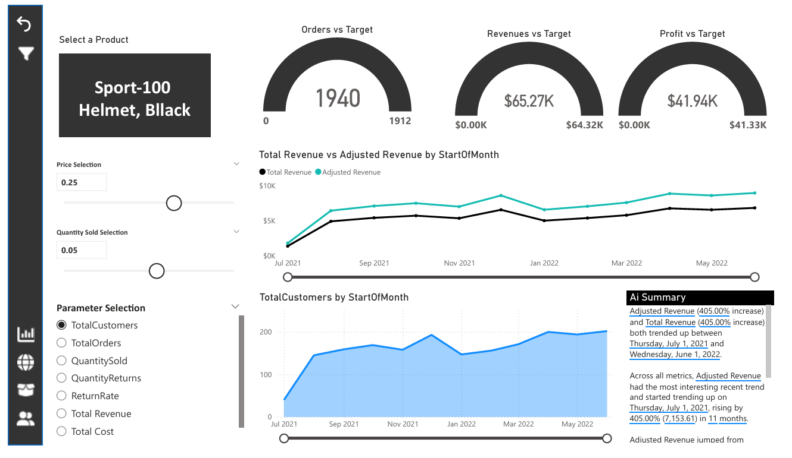
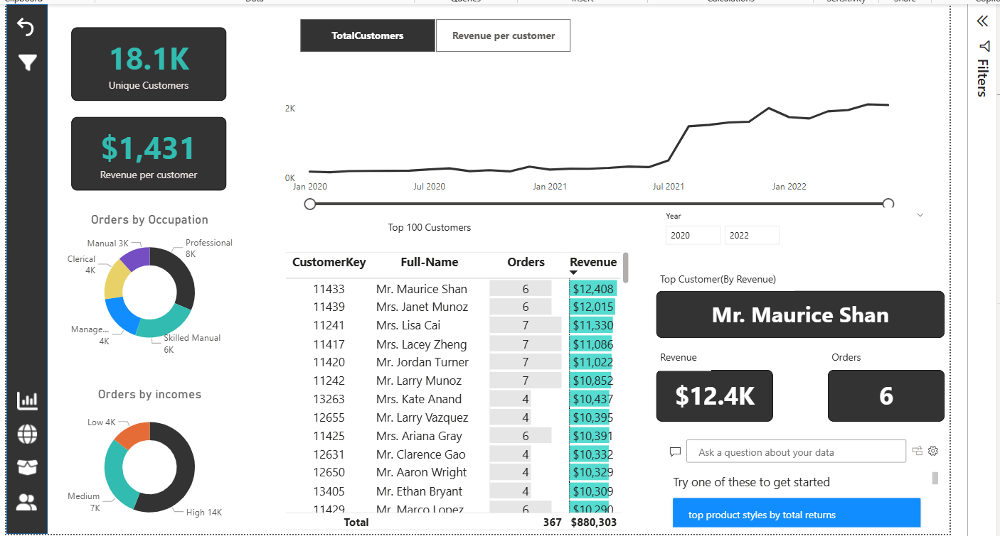
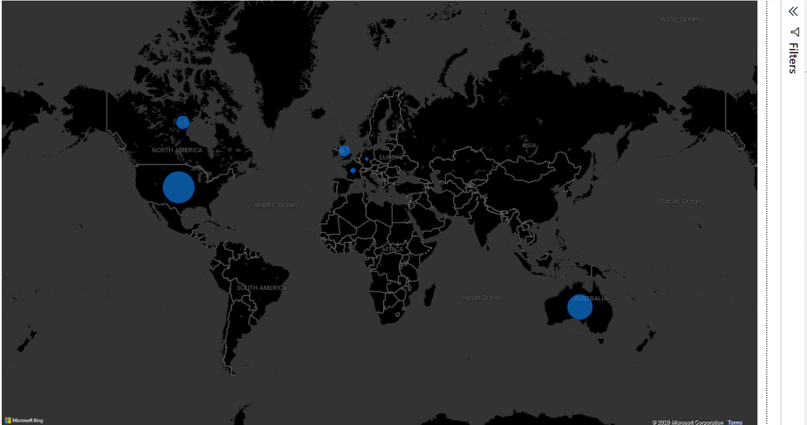

Sales Performance Analytics Dashboard

 Project Overview
This project is an interactive Power BI dashboard developed using the AdventureWorks dataset. It provides comprehensive insights into sales performance, customer behavior, product performance, and geographic sales distribution to support business decision-making.

---

 Tools & Technologies
- Power BI
- Power Query
- DAX
- Microsoft Excel

---

 Dashboard Features
- Revenue, Orders, Profit & Return Rate KPIs
- Monthly Sales Trend Analysis
- Product Performance Analysis
- Customer Insights
- Geographic Sales Distribution
- Interactive Slicers & Filters
- Drill-through Pages
- Field Parameters
- What-if Parameters
- AI Visuals
- Dynamic KPI Reporting

---

 Dashboard Pages
- Overview Dashboard
- Product Detail Dashboard
- Customer Detail Dashboard
- Geographic Sales Dashboard

---

 Key Skills Demonstrated
- Data Cleaning
- Data Transformation
- Data Modeling
- DAX Measures
- Dashboard Design
- Business Intelligence
- Data Visualization
- KPI Development

---

 Dataset
AdventureWorks Sales Dataset

---

 Author
Nada Hesham Ibrahim
linked in:
https://www.linkedin.com/in/nada-hesham-05209424a/?trk=li_LOL_DA_global_careers_jobsgtm_otwGeneral_res_Sep2023_dav2

## 📷 Dashboard Preview

### Overview Dashboard

### Product Dashboard

### Customer Dashboard

### Geographic Sales Dashboard

