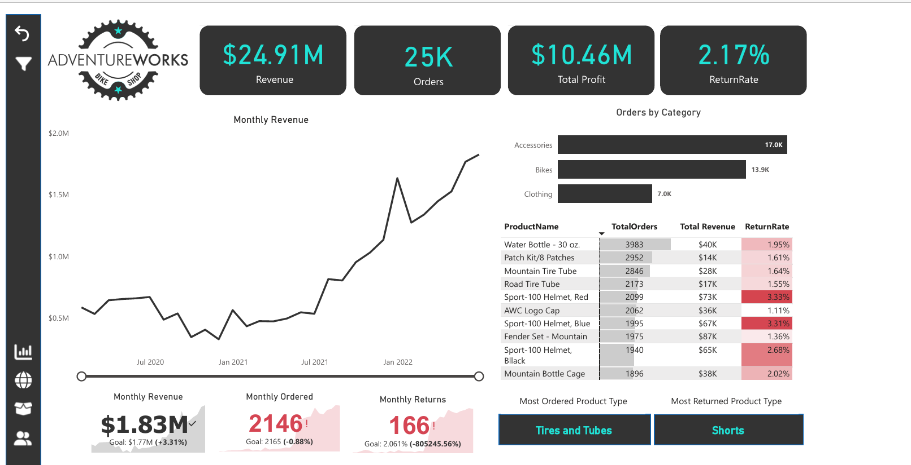
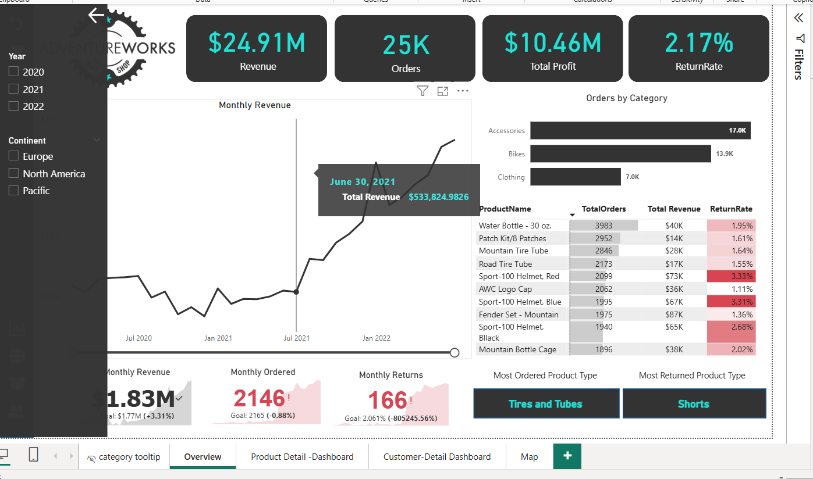
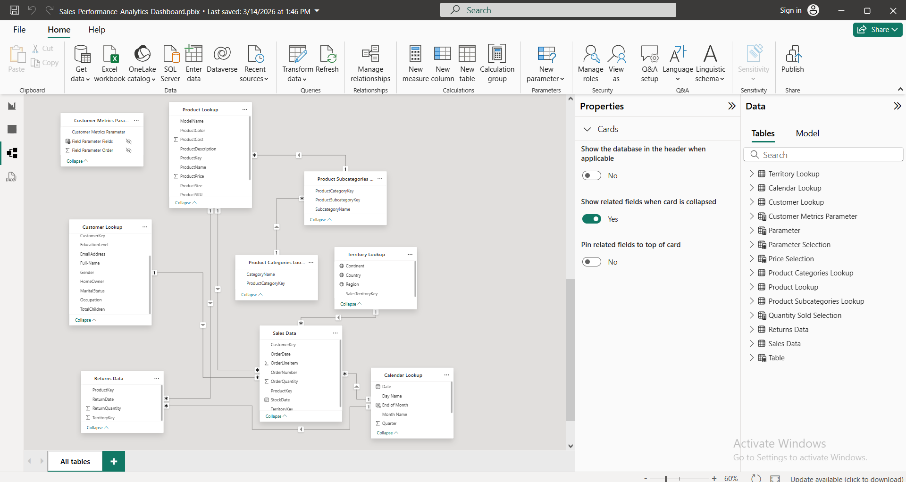
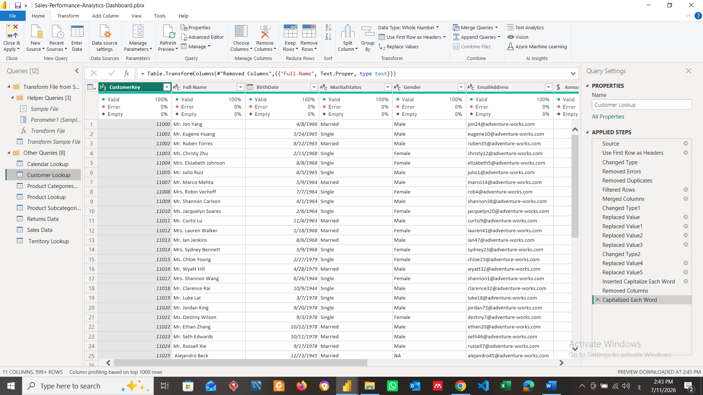
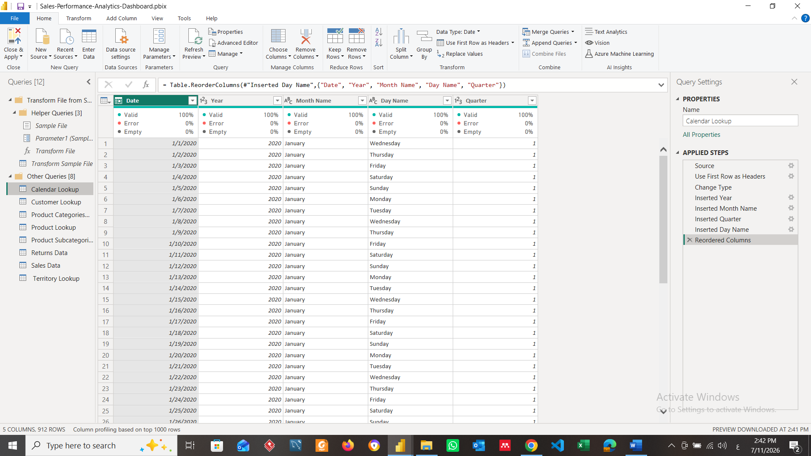

# 📊 Sales Performance Analytics Dashboard

---

## 📌 Project Overview

This project is an interactive **Power BI Sales Analytics Dashboard** developed using the **AdventureWorks** dataset. It provides comprehensive insights into sales performance, customer behavior, product performance, and geographic sales distribution to support data-driven business decisions.

---

## 🔄 Project Workflow

1. AdventureWorks Dataset
2. Power Query (ETL)
3. Data Modeling
4. DAX Measures
5. Interactive Dashboard
6. Business Insights

## 🛠️ Tools & Technologies

- Power BI
- Power Query
- DAX
- Microsoft Excel

---

## 📈 Dashboard Features

- Revenue, Orders, Profit & Return Rate KPIs
- Monthly Sales Trend Analysis
- Product Performance Analysis
- Customer Insights
- Geographic Sales Distribution
- Interactive Slicers & Filters
- Drill-through Pages
- Field Parameters
- What-if Parameters
- AI Visuals
- Dynamic KPI Reporting

---

## 📷 Dashboard Preview

### Executive Overview

### Sales Overview

### Product Analysis

### Customer Analysis

### Geographic Analysis

---
## 🗂️ Data Model

The project follows a structured relational data model to support efficient reporting and DAX calculations.

## 🔄 Data Preparation (Power Query)

Data was cleaned and transformed using **Power Query** before loading it into the data model.

The ETL process included:

- Removing errors and duplicate records
- Filtering unnecessary rows
- Changing data types
- Replacing inconsistent values
- Merging columns
- Removing unnecessary columns
- Formatting text fields
- Creating a Calendar table for time intelligence

### Power Query (ETL)

### Calendar Query

## 💡 Business Insights

- Identified top-performing products based on revenue and order volume.
- Analyzed customer purchasing behavior and customer segmentation.
- Evaluated monthly sales performance trends.
- Compared sales performance across different geographic regions.
- Monitored key business KPIs including Revenue, Profit, Orders, and Return Rate.

---

## 🎯 Key Skills Demonstrated

- Data Cleaning
- Data Transformation
- Data Modeling
- Power Query
- DAX Measures
- KPI Development
- Dashboard Design
- Business Intelligence
- Data Visualization

---

## 📂 Dataset

AdventureWorks Sales Dataset

---

## 👩‍💻 Author

**Nada Hesham Ibrahim**

### LinkedIn

[View my LinkedIn Profile](https://www.linkedin.com/in/nada-hesham-05209424a/)
